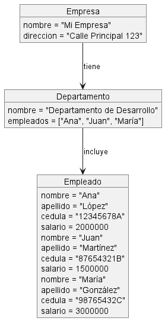

**Descricion del Diagrama de objeto Pantuml representado un sistema de gestión de empleados en una empresa**

este ejercicio representa un sistema de gestión de empleados en una empresa utilizando objetos y relaciones entre ellos. Cada objeto tiene atributos específicos que describen sus características, y las relaciones entre los objetos representan la estructura y la pertenencia dentro del sistema.

**Objeto Empresa:**

- Este objeto representa una empresa y tiene dos atributos: nombre y dirección.
- El atributo nombre contiene el nombre de la empresa ("Mi Empresa").
- El atributo dirección contiene la dirección de la empresa ("Calle Principal 123").

**Objeto Departamento:**

- Este objeto representa un departamento dentro de la empresa y tiene dos atributos: nombre y empleados.
- El atributo nombre contiene el nombre del departamento ("Departamento de Desarrollo").
- El atributo empleados es una lista que contiene los nombres de los empleados que pertenecen a este departamento ("Ana", "Juan", "María").

**Objetos Empleado:**

- Estos objetos representan a los empleados de la empresa.
- Cada objeto Empleado tiene atributos como nombre, apellido, dni y salario.
- Se han creado tres objetos Empleado con diferentes datos: "Ana López", "Juan Martínez" y "María González".

**Relaciones:**

- La relación entre la Empresa y el Departamento se representa con la flecha -->, indicando que la empresa tiene un departamento.
- La relación entre el Departamento y los Empleados se representa también con la flecha -->, indicando que el departamento incluye a los empleados.

